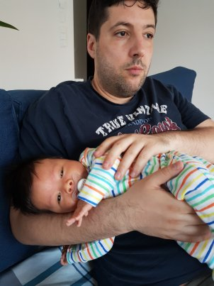
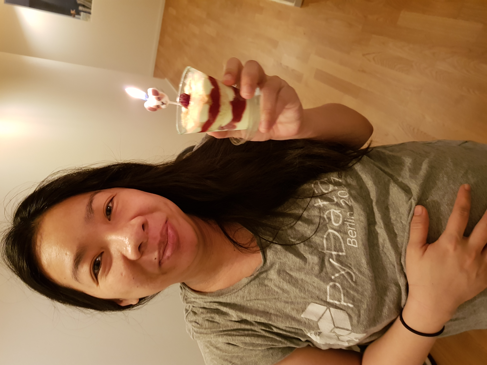

# Angelo's README

## What is this???

This is a document I prepared, whose purpose is to give a few hints about myself and help the people who work with me.

It is an introduction on myself, my working style and principles. I try also to make it educating for anybody who might right it.

## Who am I

This guy here...

I live in Berlin with my wife Kim

and our son Giorgo

.

I was born and grew up in this [small place in Greece](https://goo.gl/maps/xev7eYvv7T32).
Some things I enjoy in life are
* Playing with Giorgo
* Books
* Coffee
* LISP
* Japanese food

## Why I am here, a.k.a my job

* Help teams to be autonomous and amazing.
* Provide information and context.
* Attract, grow and retain great people.
* Foster a culture of passion, craftsmanship, collaboration and pragmatism, resulting to products their builders are proud of.

## How I can help you?

* <b>Information routing.</b> A big part of my job is being an information router within our domain and other projects and domains. I will update you as much as I can, but please feel free to ask anything you want to know about.
* <b>Firefight.</b> When things go south and we need a hand. Keep in mind everybody has flops from time to time and the shame is to hide them under the carpet than trying to resolve them and learn from them.
* <b>Drop in technical ideas and hints.</b> I am doing this job for 15 years now, from embedded to Petabyte-scale systems and nearly everything between. Sometimes I can drop a good idea that helps people get out of a tough spot. :P
* <b>Provide the view of the outsider.</b> I am not going to work on the code in a daily basis but still I will be close enough to provide some informed views.
* <b>Cheer, encourage and be there to discuss.</b> Part of my job is to be your supporter, promoter, ambassador and cheerleader.
* And <b>anything else</b> that you can come up with and I can do.

## How can you help me?

* Be self-driven.
* Do an amazing job.
* Keep politics out of the door, I really don't like them and it can only ruin our relationship. And by politics I mean not only with me but everybody else in the organization.
* Bring in your view, debate and disagree. Usually the best ideas and solutions come and evolve through debate. I will be challenging your ideas for the sake of bullet-proofing them and improving them.
* Keep your ego out of the door. I will make sure you will be treated and compensated fairly, while the results you produced will be credited to you and everybody will know about it.
  * Talk to me! Whenever you miss context, have questions or a problem just ping me. My order of preference for communication means is f2f > skype / hangouts > phone > email > sms > snail mail > telepathy. 
  -
